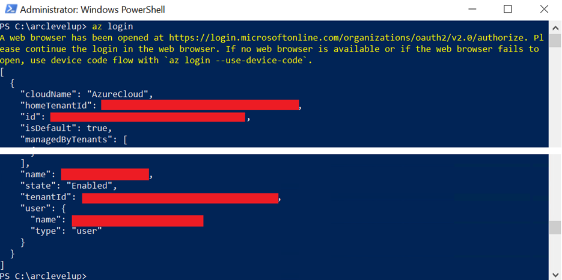

## Deploy Azure AKS Cluster

[< Previous Module](../modules/lab.md) - **[Home](../README.md)** - [Next Module >](../modules/indirect.md)

### The AKS Cluster will host the SQL MI in Azure but you could also setup Kubernetes on-premise or in another Cloud Provider such as AWS or Google Cloud

1.	Login to Azure AD

    Run the following to login from your client using your default web browser
    ```text
    az login
    ```
    

    Run the following to login from another device or non-default web browser    
      ```text
    az login --use-device-code
    ```

2.	Configure your account to be in the scope of the subscription you will be using

    ```text
    az account set --subscription <Your Subscription Id>
    ```
    

3. Display the list of regions you can deploy to

    ```text
	az account list-locations -o table
    ```
    

4. Create Resource Group (if you reuse an existing resource group it will modify any metadata but not delete any existing resources)

    ```text
	az group create --name <RG Name> --location <Region>
    ```

5.	Get the latest (IsPreview) and latest stable (Default) version for AKS

    ```text 
    az aks get-versions --location <Region> --query orchestrators -o table
    ```
    

6.	Create the AKS Cluster on 2 nodes of type Standard_D8s_v3 with a Minimum of 1 node and a Maximum of 5 nodes
    ```text
    az aks create -n <AKS Name> -g <RG Name> --generate-ssh-keys --node-vm-size Standard_D8s_v3 --node-count 2 --kubernetes-version <Stable Version> --enable-cluster-autoscaler --min-count 1 --max-count 5
    ```
    

7.	Configure access with Kubectl and ArcData

    ```text
    az aks get-credentials --resource-group <RG Name> --name <AKS Name>
    ```
    
    
    Deployed resources
    
    
[Continue >](../modules/indirect.md)
