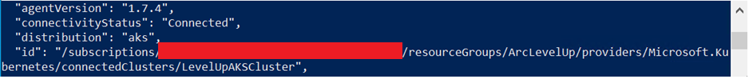
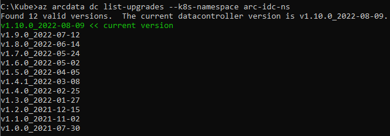

## Deploy Azure Arc Enabled SQL MI with Direct Connectivity

[< Previous Module](../modules/indirect.md) - **[Home](../README.md)**

### Deploy General Purpose and Business Critical SQL Managed Instances (Requires new AKS Cluster from Lab Step 2)

1. Login to Azure AD

    Run the following to login from your client using your default web browser

    ```text
    az login
    ```
    


    Run the following to login from another device or non-default web browser

      ```text
    az login --use-device-code
    ```

2. Configure your account to be in the scope of the subscription you will be using

    ```text
    az account set --subscription <Your Subscription Id>
    ```
    

3. List Kubernetes cluster contexts from your kubectl config

    ```txt
    kubectl config get-contexts
    ```
    

4. Switch context to the AKS Cluster you will be using to deploy the SQL MI

    ```txt
    kubectl config use-context <AKS Name>
    ```
    

5. Verify the nodes are running

    ```txt
    kubectl get nodes
    ```
    

6. Create Resource Group (if you reuse an existing resource group it will modify any metadata but not delete any existing resources)

    ```txt
    az group create --name <RG Name> --location <Region>
    ```

7. Install required extensions

    ```txt
    az extension add --name k8s-extension
    az extension add --name connectedk8s
    az extension add --name k8s-configuration
    az extension add --name customlocation
    ```
    
8. Register required providers

    ```txt
    az provider register --namespace Microsoft.Kubernetes
    az provider register --namespace Microsoft.KubernetesConfiguration
    az provider register --namespace Microsoft.ExtendedLocation
    ```
    
    
    

9. Create Azure Direct Connection to the AKS Cluster you will be using to deploy the SQL MI and then review your Resource Group

    ```txt
    az connectedk8s connect --name <AKS Name> --resource-group <RG Name>
    ```
    
    

10. Create Azure AKS Extension with auto upgrade disabled (see **[reference](https://docs.microsoft.com/en-us/cli/azure/k8s-extension?view=azure-cli-latest)** for more info)

    ```txt
    az k8s-extension create --cluster-name <AKS Name> --resource-group <RG Name> --name <Extension Name e.g. arc-dc-ext> --cluster-type connectedClusters --extension-type microsoft.arcdataservices --auto-upgrade false --scope cluster --release-namespace <Namespace e.g. arc-dc-ns> --config Microsoft.CustomLocation.ServiceAccount=<Custom Location Service Account e.g. sa-arc-dc>
    ```
    

11. Get Principal Id from returned JSON

    ```txt
    az k8s-extension show --resource-group <RG Name> --cluster-name <AKSName> --cluster-type connectedClusters --name <Extension Name> --query identity.principalId
    ```
    

12. Add role assignment to Principal Id

    ```txt
    az role assignment create --assignee <Principal Id> --role "Contributor" --scope "/subscriptions/<Your Subscription Id>/resourceGroups/<RG Name>"
    ```
    

13. Deploy Custom Location (see **[reference](https://docs.microsoft.com/en-us/cli/azure/customlocation?view=azure-cli-latest)** for more info)

    ```txt
    az customlocation create --resource-group <RG Name> --name <Custom Location Name e.g. arc-dc-cl> --namespace <Namespace> --host-resource-id /subscriptions/<Your Subscription Id>/resourceGroups/<RG Name>/providers/Microsoft.Kubernetes/connectedClusters/<AKS Name> --cluster-extension-ids /subscriptions/<Your Subscription Id>/resourceGroups/<RG Name>/providers/Microsoft.Kubernetes/connectedClusters/<AKS Name>/providers/Microsoft.KubernetesConfiguration/extensions/<Extension Name>
    ```
    

14. Deploy Data Controller using Azure Infrastructure (see **[reference](https://docs.microsoft.com/en-us/cli/azure/arcdata/dc?view=azure-cli-latest)** for more info)

    ```txt
    az arcdata dc create --connectivity-mode direct --name <Data Controller Name e.g. arc-dc> --subscription <Your Subscription Id> --resource-group <RG Name> --location <Region> --storage-class managed-premium --profile-name azure-arc-aks-premium-storage --infrastructure azure --custom-location <Custom Location Name> --cluster-name <AKS Name>
    ```
    

15. Verify Data Controller (DC) has been created successfully by ensuring new pods have been created for the DC.

    ```txt
    kubectl get pods -n <Namespace>
    ```
    

16. Deploy a Development General Purpose Arc Enabled SQL MI with 1 replica, 2 vCores with a maximum of 4, 4GB of memory with a maximum of 8, managed premium storage for everything apart from backups where managed premium is not available (see **[reference](https://docs.microsoft.com/en-us/cli/azure/sql/mi-arc?view=azure-cli-latest)** for more info)

    ```txt
    az sql mi-arc create --name <GP SQL MI Name> --resource-group <RG Name> --custom-location <Custom Location Name> --replicas 1 --cores-request "2" --cores-limit "4" --memory-request "4Gi" --memory-limit "8Gi" --storage-class-data "managed-premium" --storage-class-datalogs "managed-premium" --storage-class-logs "managed-premium" --storage-class-backups "azurefile" --volume-size-data 64Gi --volume-size-datalogs 64Gi --volume-size-logs 5Gi --volume-size-backups 64Gi --tier GeneralPurpose --dev --license-type BasePrice
    ```
    

17. Deploy a Development Business Critical Arc Enabled SQL MI with 3 replicas, 2 vCores with a maximum of 4, 4GB of memory with a maximum of 8, managed premium storage for everything apart from backups

    ```txt
    az sql mi-arc create --name <BC SQL MI Name> --resource-group <RG Name> --custom-location <Custom Location Name> --replicas 3 --cores-request "2" --cores-limit "4" --memory-request "4Gi" --memory-limit "8Gi" --storage-class-data "managed-premium" --storage-class-datalogs "managed-premium" --storage-class-logs "managed-premium" --storage-class-backups "azurefile" --volume-size-data 64Gi --volume-size-datalogs 64Gi --volume-size-logs 5Gi --volume-size-backups 64Gi --tier BusinessCritical --dev --license-type BasePrice
    ```
    

18. Verify both Managed Instances were successfully created

    ```txt
    kubectl get services -n <Namespace>
    ```
    Look for entries for \<GP SQL MI Name\>-external-svc and \<BC SQL MI Name\>-external-svc and note the Public IP Addresses (EXTERNAL-IP)

    
    
## Connecting to Arc-enabled SQL Managed Instances

1. View Arc-enabled SQL Managed Instances

    `az sql mi-arc list --k8s-namespace <namespace> --use-k8s -o table`

    

2. Add NSG rule for your Azure Kubernetes
    1. Getting NSG name

     `az network nsg list -g <Node RG Name> --query "[].{NSGName:name}" -o table`

    2. Add NSG rule to allow your IP

    `az network nsg rule create -n db_port --destination-port-ranges 1433 --source-address-prefixes '*' --nsg-name <NSG Name> --priority 500 -g <Node RG Name> --access Allow --description 'Allow port through for db access' --destination-address-prefixes '*' --direction Inbound --protocol Tcp --source-port-ranges '*'`

3. Connect to your Arc-enabled SQL Managed Instances General Purpose
    1. Get the IP from the step 11 and connect to Arc-enabled SQL MI GP using SQL Server Management Studio and Azure Data Studio  
    
    2. [Connect to Azure Arc-enabled SQL Managed Instance](https://docs.microsoft.com/en-us/azure/azure-arc/data/connect-managed-instance)
    

## Upgrading the Arc-enable Data Controller

1. Pull the list of available images for the data controller with the following command:

    `az arcdata dc list-upgrades --k8s-namespace <namespace>`

    

2. Upgrade the Arc data controller extension first

   Retrieve the name of your extension and its version

   `az k8s-extension list --resource-group <resource-group> --cluster-name <connected cluster name> --cluster-type connectedClusters`

   

3. Upgrade the extension

    `az k8s-extension update --resource-group <resource-group> --cluster-name <connected cluster name> --cluster-type connectedClusters --name <name of extension>`

4. You can perform a dry run first. The dry run validates the registry exists, the version schema, and the private repository authorization token (if used).

    `az arcdata dc upgrade --resource-group <resource group> --name <data controller name> --desired-version <version> --dry-run [--no-wait]`

5. To upgrade the data controller, run the az arcdata dc upgrade command, specifying the image tag with **--desired-version**.

    `az arcdata dc upgrade --resource-group <resource group> --name <data controller name> --desired-version <version> [--no-wait]`

6. Monitor the upgrade status

   `az arcdata dc status show --name <data controller name> --k8s-namespace <namespace> --use-k8s`

## Upgrading the Arc-enable SQL MI

1. The dry run validates the version schema and lists which instance(s) will be upgraded

   `az sql mi-arc upgrade --resource-group <resource group> --name <instance name> --dry-run`

   

### General Purpose

> [!CAUTION]
> During a **Arc-enable SQL MI General Purpose** upgrade, the pod will be terminated and reprovisioned at the new version. This will cause a short amount of downtime as the new pod is created.

### Business Critical

During a Arc-enable SQL MI Business Critical upgrade with more than one replica:

- The secondary replica pods are terminated and reprovisioned at the new version
- After the replicas are upgraded, the primary will fail over to an upgraded replica
- The previous primary pod is terminated and reprovisioned at the new version, and - becomes a secondary

> [!CAUTION]
> There is a brief moment of downtime when the failover occurs.

1. To upgrade Arc-enable SQL MI, use the following command

    `az sql mi-arc upgrade --resource-group <resource group> --name <instance name> --desired-version <imageTag> [--no-wait]`

2. Monitor the progress of the upgrade with the show command

    `az sql mi-arc show --resource-group <resource group> --name <instance name>`

    

## Enable SQL Server Agent

SQL Server agent is disabled by default.

1. To enable SQL Server Agent run:

    `az sql mi-arc update -n <instance name> --k8s-namespace <namespace> --use-k8s --agent-enabled true`

    

2. Verifying if it is enabled

    `az sql mi-arc show --resource-group arc-direct --name sql-mi-bc`

    

## Restore

1. Create a credential

    [Create SAS tokens](https://docs.microsoft.com/en-us/azure/cognitive-services/translator/document-translation/create-sas-tokens?tabs=Containers)

```sql
USE master
GO

IF NOT EXISTS  
(SELECT * FROM sys.credentials
WHERE name = 'https://<mystorageaccountname>.blob.core.windows.net/<mystorageaccountcontainername>')  
BEGIN
    CREATE CREDENTIAL [https://<mystorageaccountname>.blob.core.windows.net/<mystorageaccountcontainername>]
    -- this name must match the container path, start with https and must not contain a forward slash at the end
    WITH IDENTITY = 'SHARED ACCESS SIGNATURE',  -- this is a mandatory string and should not be changed   
    SECRET = '<SAS_TOKEN>';
END;
```

2. Enable the trace flag - There is a bug and the PG is aware of it

```sql
DBCC traceon(1820,-1)
```

3. Verify the backup file is readable, and intact

```sql
RESTORE FILELISTONLY 
FROM URL = 'https://<mystorageaccountname>.blob.core.windows.net/<mystorageaccountcontainername>/<file name>.bak'
```

4. Prepare and run the RESTORE DATABASE

```sql
RESTORE DATABASE <database name> FROM URL = 'https://<mystorageaccountname>.blob.core.windows.net/<mystorageaccountcontainername>/<file name>.bak'
WITH MOVE 'Test' to '/var/opt/mssql/data/<file name>.mdf'
,MOVE 'Test_log' to '/var/opt/mssql/data/<file name>.ldf'
,RECOVERY;  
GO
```

## Transparent Data Encryption (TDE)

Turning on transparent data encryption in Arc-enable SQL MI follows the same steps as SQL Server on-premises.

Use the following steps to [enable TDE](https://docs.microsoft.com/sql/relational-databases/security/encryption/transparent-data-encryption?view=sql-server-ver16#enable-tde).

```sql
USE master;
GO

CREATE MASTER KEY ENCRYPTION BY PASSWORD = 'UseStrongPasswordHere!';
GO

CREATE CERTIFICATE MyServerCert WITH SUBJECT = 'My DEK Certificate';
go

USE AdventureWorks;
GO

CREATE DATABASE ENCRYPTION KEY
WITH ALGORITHM = AES_256
ENCRYPTION BY SERVER CERTIFICATE MyServerCert;
GO

ALTER DATABASE AdventureWorks
SET ENCRYPTION ON;
GO

USE AdventureWorks;
GO
/* The value 3 represents an encrypted state
   on the database and transaction logs. */
SELECT *
FROM sys.dm_database_encryption_keys
WHERE encryption_state = 3;
GO
```

### Back up a transparent data encryption credential

1. Back up the certificate from the container to /var/opt/mssql/data

```sql
USE master;
GO

BACKUP CERTIFICATE <cert-name> TO FILE = '<cert-path>'
WITH PRIVATE KEY ( FILE = '<private-key-path>',
ENCRYPTION BY PASSWORD = '<UseStrongPasswordHere>');
```

2. Copy the certificate from the container to your file system

    |operating System  | Command  | Example |
    |---------  |---------|---------|
    |Windows     | `kubectl exec -n <namespace> -c arc-sqlmi <pod-name> -- cat <pod-certificate-path> > <local-certificate-path>`   | `kubectl exec -n arc-idc-ns -c arc-sqlmi arc-sql-mi-gp-0 -- cat /var/opt/mssql/data/myservercert.crt > C:\temp\sqlcerts\myservercert.crt` |
    |Linux     |    `kubectl cp --namespace <namespace> --container arc-sqlmi <pod-name>:<pod-certificate-path> <local-certificate-path>` | `kubectl cp --namespace arc-idc-ns --container arc-sqlmi arc-sql-mi-gp-0:/var/opt/mssql/data/servercert.crt $HOME/sqlcerts/myservercert.crt` |

    To get pods name use this command

    `kubectl get pods -n <namespace>`

3. Copy the private key from the container to your file system

    |operating System  |Command  | Example |
    |---------|---------|---------|
    |Windows     |  `kubectl exec -n <namespace> -c arc-sqlmi <pod-name> -- cat <pod-private-key-path> > <local-private-key-path>`   |`kubectl exec -n arc-idc-ns -c arc-sqlmi arc-sql-mi-gp-0 -- cat /var/opt/mssql/data/myservercert.key > C:\temp\sqlcerts\myservercert.key`|
    |Linux     |  `kubectl cp --namespace <namespace> --container arc-sqlmi <pod-name>:<pod-private-key-path> <local-private-key-path>`        | `kubectl cp --namespace arc-idc-ns --container arc-sqlmi arc-sql-mi-gp-0:/var/opt/mssql/data/myservercert.key $HOME/sqlcerts/myservercert.key`|
